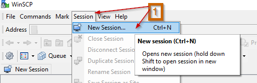
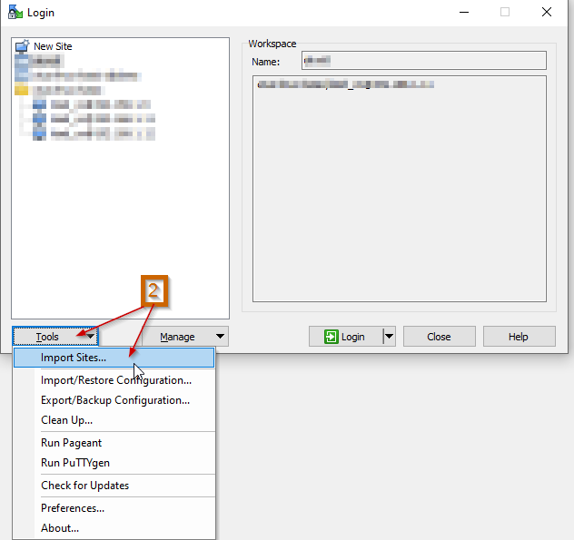
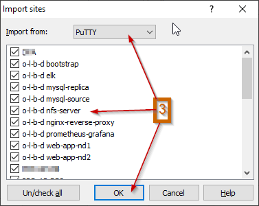

# Содержание

1. [Введение](#into)
    1. [Контекст среды эксплуатации](#intro_context)
    2. [Инфраструктура web-приложения](#intro_web-app)
    3. [Операции](#intro_ops)
        1. [Полный бакап БД](#intro_ops_db-full-backup)
        2. [Инкрементный бакап БД](#intro_ops_db-inc-backup)
        3. [Восстановление БД из бакапа](#intro_ops_db-rec)
        4. [Установка вычислительного узла](#intro_ops_install)
2. [Среда администратора](#adm-env)
    1. [Putty](#adm-env_putty)
    2. [WinSCP](#adm-env_winscp)
    3. [Каталоги](#adm-env_dirs)
3. [Тестовый стенд](#test-env)
    1. [Виртуальные машины](#test-env_vm)
        1. [Bootstrap VM](#test-env_vm_bootstrap)
        2. [Bootstrap VM ELK](#test-env_vm_bootstrap-elk)
    2. [Структура каталогов](#test-env_dirs)
    3. [Инструкция по развертыванию среды](#test-env_install)


# <a name="intro"></a> Введение

Дипломная работа "Инфраструктура эксплуатации, отслеживания, восстановления работоспособности web-приложения в малом предприятии" по курсу Otus Linux Basic 2023-10.

В работе представлена настройка инфрастукруры для работы веб-приложения в реалиях малого предприятия.
Описано рабочее окружение администратора, настройка инструментов.
К демонстрации представлен стенд с развёрными вычислительными узлами из исходных кодов работы.

## <a name="intro_context"></a> Контекст среды эксплуатации

Данная работа предполагает небольшое предприятия в сфере производства.
Штат IT администраторов составляет не более двух человек.
Большую часть времени администраты решают проблемы пользователей внутри офисной площадки.
Деятельность по поддержанию работоспособности серверного ПО (веб-сайты, базы данных, файловые сервера) является дополнительной нагрузкой администраторов, вменённой руководством по остаточному принципу.

Разработка ПО отдана внешним подрядчикам.
Администраторы обслуживают ПО строго по инструкции от разработчиков.

## <a name="intro_web-app"></a> Инфраструктура web-приложения

Для упрощения разработки и внедрения, приложение должно работать в docker-контейнере.
Контейнеризация гарантирует идентичность среды выполнения.
Таким образом исключается необходимость отслеживать компоненты ОС.
Администраторы могут сменить среду эксплуатации бесшовно.
Единственной зависимостью остаётся архитектура процессоров.

В данной работе предполагается, что подрядчик подготовил веб-приложение со следующими требованиями:
* Веб приложение может быть запущено более чем в одном контейнере;
* Веб приложению требуется:
    * общий файловый каталог, разделяемый всеми запущенными экземплярами,
    * подключение к базе данных.
* Подрядчик должен предоставить dockerfile и инструкции по сборке и запуску.

Для демонстрации веб-приложения использована CMS Wordpress.
Приложение будет работать внутри докер-контейнеров на двух узлах:
* web-app-nd1 (192.168.1.15);
* web-app-nd2 (192.168.1.16).
Для администраторов предоставляется тестовая страница "http://.../hello.php" c внутренними названием и IP адресом контейнера веб-приложения.
Пример содержимого hello.php:
```
Host name: a1d3115735be
Host IP: 172.17.0.2
```
a1d3115735be - GUID докер-контейнера, 172.17.0.2 - IP адрес контейнера внутри докер-сети.
Логи работы веб-приложения записываются в каталог узла через подключенный том докер-контейнера.

Базой данных из требований Wordpress выступает MySql.
СУБД работает на узле "mysql-source" (192.168.1.13).
Для снятия бакапов развернута реплика "mysql-replica" (192.168.1.14).

Общее файловое хранилище обеспечивает NFS сервер на узле "nfs" (192.168.1.12).
К узлу подключен отказоустойчивый диск, на котором размещаются файлы приложения и бакапы БД.
NFS сервер предоставляет сетевой доступ к файлам для веб-риложения незаметно, через подключение nfs-тома к докер-контейнеру.

Распределение нагрузки между узлами веб-приложения поручено серверу nginx-rev-proxy (192.168.1.17).
Этот же сервер перенаправляет пользователей в случае отказа одного из узлов веб-приложения.

На каждом узле инфраструктуры поднят файрволл на базе IPTABLES.
Доступны только
* исходящие подключения TCP и UDP,
* все подключения внутри хоста (только 127.0.0.1),
* входящие пакеты в рамках установленных TCP сессий,
* входящие ssh, dns подключения,
* входящие TCP или UPD подключения в рамках развернутых на узле сервисов.

Для наблюдения за состоянием компонентов узлов развернут сервис Prometheus и Grafana на узле "prometheus-grafana" (192.168.1.18).
На каждый вычислительный узел установлен экспортер метрик.
На узел "nginx-rev-proxy" установлен экспортер метрик nginx.
В Grafana настроены стандартные дашборты для узлов.
Дашборд для nginx, как и экспортер метрик, предоставлен разработчиками nginx.

Для целей первичной диагностики проблем с веб-приложением установлен и настроен elk стек на узле "elk" (192.168.1.19).
На узлах "nginx-rev-proxy" (192.168.1.17), "web-app-nd1" (192.168.1.15), "web-app-nd2" (192.168.1.16) установлен filebeat - экспортер логов.

## <a name="intro_ops"></a> Операции

В обязанности администраторов входит на регулярной основе проводить:
* полный логический бакап БД для восстановления данных после утери узлов СУБД;
* инкрементный логический бакап БД для точечного ручного восстановления данных;
* отслеживания нагрузки на узлы для масштабирования/обновления парка машин.

Частота сбора полного и инкрементного бакапов зависят только от Recovery Time Objective и Recovery Point Objective, выдвинутых бизнесом.

### <a name="intro_ops_db-full-backup"></a> Полный бакап БД

Полный логический бакап нужен для восстановления данных после утраты узла "mysql-source".

Полный бакап делается на узле "nfs" командой
```bash
sudo /usr/sbin/dump-mysql-serverwise.sh
```

Скрипт складывает бакап на отказоустойчивый диск в формате "tgz".
Имя файлу выбирается по схеме "all\_db\_on\_ГГГГММДД\_ЧЧммСС\_UTC.sql".
Такая схема позволяет сортировать файлы от старых к новым по имени.
Файлы полного логического бакапа сохраняются в каталог "/mnt/prod-data-drive/dbms-bcp/serverwise/".

### <a name="intro_ops_db-inc-backup"></a> Инкрементный бакап БД

Инкрементный логический бакап должен выполняться чаще полного бакапа.
Он позволяет точечно найти отличия в данных и составить SQL инструкции для их восстановления.
Есть два рода ситуаций, когда инкрементный логический бакап может быть полезен для восстановления данных:
* после ошибки пользователя, удаливешего/изменившего данные;
* после полного восстановления узла mysql-source, когда нужно восстановить данные за промежуток от полного бакапа до падения СУБД.

В данной работе приведен пример инкрементного логического бакапа.
Он выполняется на сервере "nfs" командой
```bash
sudo /usr/sbin/dump-mysql-tablewise.sh
```
Скрипт создает каталог для каждой пользователькой БД, в него помещает SQL файлы с содержимым таблиц.
Файлы архивируются в формат "gz", весь каталог бакапа архивируется в формат "tar".
Архиву присваивается имя в формате "ГГГГММДД\_ЧЧммСС\_UTC.tar"
Такая схема позволяет сортировать файлы от старых к новым по имени.
Файлы инкрементного логического бакапа сохраняются в каталог "/mnt/prod-data-drive/dbms-bcp/tablewise/".

Администраторам предстоит самостоятельно реорганизовать дальнейшее хранение файлов инкрементного бакапа для минимизации потребляемого места.

### <a name="intro_ops_db-rec"></a> Восстановление БД из бакапа

Восстановить БД можно из любого полного логического бакапа.
Для восстановления последнего бакапа, собранного "dump-mysql-serverwise.sh", нужно запустить на узле "nfs" команду
```bash
sudo /usr/sbin/restore-mysql-serverwise.sh
```

### <a name="intro_ops_install"></a> Установка вычислительного узла

В данной работе предполагается ручные конфигурирование и установка ПО на узлах посредством подготовленных bash скриптов.
Последовательность действий следующая:
1. Разворачивается машина с предустановленной ОС (bootstrap);
2. Администратор подключается к машине и копирует директорию со скриптами, файлами конфигурации, пакетами ПО;
3. Администратор выдает разрешение на выполнение скопированных bash скриптов командой `. __make_executable.sh`;
4. Администратор изменяет IP адрес и хостовое имя машины командой `sudo ./00.prepare-vm-РОЛЬ-УЗЛА.sh`;
5. Администратор устанавливает и конфигурирует ПО командой `sudo ./01.install-ПАКЕТ-ПО.sh`.

# <a name="adm-env"></a> Среда администратора

Для работы администратора, кроме обычного ПО, минимально необходимы два компонента:
* ssh клиент для подключения к узлам;
* каталог со скриптами восстановления, ПО и конфигурациями.

Для удобства администрирования в данной работе предлагаются следующие программные компоненты:
* PuTTY - уважаемый и безопасный ssh клиент для машин с ОС Windows;
* WinSCP - удобный файловый менеджер с интеграцией PuTTY.

## <a name="adm-env_putty"></a> Putty

Для установки PuTTY нужно скачать файл-установщик с сайта "https://www.putty.org".

PuTTY подразумевает, что все настройки, вносимые в PuTTY Configuration принадлежат одному подключению.
Конфигурация производится по следующего алгоритму:
1. Загружаются настройки подключения;
2. Настройки редактируются;
3. Настройки сохраняются с тем же или новым именем подключения.

Для минимально комфортной конфигурации PuTTY нужно:
1. Выбрать Default Settings, нажать "Load";
2. Выбрать тип подключения ssh, ввести адрес или IP целевой машины;
* 
3. Открыть в дереве настроек "Connection" -> "Data";
4. Ввести имя пользователя на целевой машине;
* 
5. Вернуться на вкладку "Session";
6. Ввести название подключения;
7. Нажать "Save".
* 

Администратор должен подготовить подключения к каждой из 8 машин:
* nfs
* mysql-source
* mysql-replica
* web-app-nd1
* web-app-nd2
* nginx-rev-proxy
* prometheus\_graphana
* elk

По умолчанию, PuTTY пытается установить подключение по открытым ключам пользователя.
Это безопасный, надёжный, быстрый способ подключения по SSH.
Лишь при отсутствии подходящей пары PuTTY предложит авторизоваться паролем пользователя.

Конфигурация авторизации по открытым ключам состоит из:
1. Создания пары открытого и закрытого ключей в PuTTYgen;
2. Добавление открытого ключа на целевую машину;
3. Добавление автозагрузки закрытого ключа в Pageant.

PuTTYgen входит в пакет программ PuTTY.
Для создания ключей нужно
1. выбрать тип и размер ключа, нажать "Generate";
* 
2. скопировать и сохранить в стороне публичный ключ для SSH;
* 
3. нажать "Save private key", сохранить закрытый ключ в директорию `%USERPROFILE%\.ssh`;
* 
4. повторить для "Save public key" c расширением ".pub";

Публичный ключ копируется в директорию пользователя на целевой машине:
1. подключиться к целевой машине;
2. открыть в редакторе файл "~/.ssh/authorized\_keys";
3. добавить отдельно сохраненный публичный ключ SSH;
4. оставить пустую строку в конце файла, сохранить.

PuTTY использует закрытые ключи для авторизации из агента Pageant.
Настройка Pageant заключается в:
1. настройке автозапуска: "Run" (Win + R) "shell:startup";
2. добавления ярлыка Pageant: найти Pageant, создать ярлык (перетащить ПКМ) в "shell:startup";
* 
3. добавления закрытого ключа в автозагрузку:
    1. в свойствах ярлыка в "Target:" указать "%USERPROFILE%\.ssh";
    2. в свойствах ярлыка в "Start in:" добавить название закрытого ключа с расширением файла.
* 

## <a name="adm-env_winscp"></a> WinSCP

Получить установщик можно на официальном сайте "https://winscp.net".

Минимальная конфигурация заключается в импорте списка подключений PuTTY:
1. В меню окна выбрать "Session" -> "New Session...";
* 
2. В окне подключения выбрать "Tools" -> "Import Sites...";
* 
3. В окне импорта подключений выбрать импорт из "PuTTY", отметить подключения, нажать "OK".
* 

## <a name="adm-env_dirs"></a> Каталоги

Для быстрого восстановления узлов администратор должен воспроизвести стуктуру каталогов проекта.
Кроме того, администратор должен подготовить пакеты ПО для быстрого копирования при восстановлении узлов:
* ./recovery/
    * apache-filebeat/
        * filebeat/
            * filebeat\_8.9.1\_amd64-224190-656d53.deb
    * nginx-reverse-proxy-filebeat/
        * filebeat/
            * filebeat\_8.9.1\_amd64-224190-656d53.deb
    * prometheus-grafana/
        * grafana/
            * grafana_10.2.2_amd64_224190_2cad86-224190-460adc.deb
    * elk/
        * elk/
            * elasticsearch_8.9.1_amd64-224190-509cdd.deb
            * kibana_8.9.1_amd64-224190-c09868.deb
            * logstash_8.9.1_amd64-224190-e7a1b1.deb


# <a name="test-env"></a> Тестовый стенд

Тестовый стенд развернут на машине с
* Windows 10 Pro (R) с MS Hyper-V (R) platform;
* Intel(R) Core(TM) i7-8550U;
* 16 GiB ОЗУ;
* 100 GiB места на диске;
* подключенным внешним жестким диском на том E:\\.

Для доступа по сети предусмотрен разделяемый виртуальный свитч, работающий поверх Ethernet адаптера Realtek PCIe GbE Family Controller.

## <a name="test-env_vm"></a> Виртуальные машины

Рядом с каталогом проекта помещен каталог с исходными образами ВМ.
Их два:
* bootstrap - для обычных узлов;
* bootstrap-elk - специальный образ для требовательного ELK стека.
На внешнем жестком диске создан образ диска Hyper-V для имитации внешнего отказоустойчикого носителя.

### <a name="test-env_vm_bootstrap"></a> Bootstrap VM

Основная ВМ для развертывания вычислительных узлов сети.
Всегда занимает IPv4 адрес 192.168.1.11.

В образе
* установлена ОС Ubuntu 22.04;
* добавлен пользователь с группой sudoers;
* добавлен публичный ключ пользователя для авторизации подключений по SSH;
* в конфигурации sudo прописано выполнение команд без ввода пароля;
* предзагружено, но не установлено ПО для большинства (но не всех) сервисов проекта;
* установлена дефолтная конфигурация netplan со статическим адресом 192.168.1.11.

Одна ВМ требует:
* от 512 MiB до 1536 MiB ОЗУ;
* места для жесткого диска до 12 GiB (увеличение по мере использования) + файлы ВМ;
* 1 виртуальный CPU с диапазоном потребления от 0% до 100% без резервирования;
* виртуальный свитч для сетевого подключения.

### <a name="test-env_vm_bootstrap-elk"></a> Bootstrap VM ELK

Специальный образ bootstrap для нужно ELK стека.
Отличается настройкой диска и ОЗУ:
* диск увеличен до 24 GiB;
* предел ОЗУ увеличен до 4096 MiB;
* системный раздел Ubuntu расширен;
* добавен своп раздел.

## <a name="test-env_dirs"></a> Структура каталогов

Развернута [рекомедуемая структура](#adm-env_dirs).
Внутрь каталога "recovery" добавлен каталог для исходных образов виртуальных машин "VM".
На внешнем диске помещен файл образа диска Hyper-V для узла "nfs": "e:\linux-basic-diploma\NFS-server\NFS-prod-data-drive.vhdx"

## <a name="test-env_install"></a> Инструкция по развертыванию среды
Для развертывания среды с нуля смотри [восстановление работоспособности при утрате вычислительной инфрастуктуры](./recovery/README_disaster_recovery.md).

